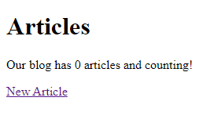
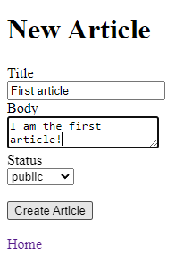
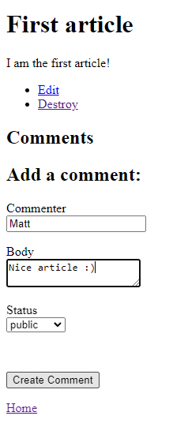

# Blog App

This is the "Getting Started with Rails" app on the Ruby on Rails docs.

<a href="https://guides.rubyonrails.org/getting_started.html">https://guides.rubyonrails.org/getting_started.html</a>

Very simple blogging app in which users can create new articles, edit, and delete articles. Includes the most basic of authentication.

This was my first introduction to Ruby on Rails. It helped introduce to me the framework, the MVC architecture and various built in methods including generating resources / models and more.

  

  

  

  

