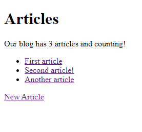

# Blog App

This is the "Getting Started with Rails" app on the Ruby on Rails docs.

<a href="https://guides.rubyonrails.org/getting_started.html">https://guides.rubyonrails.org/getting_started.html</a>

Very simple blogging app in which users can create new articles, edit, and delete articles. Includes the most basic of authentication.

  

  

  

  

